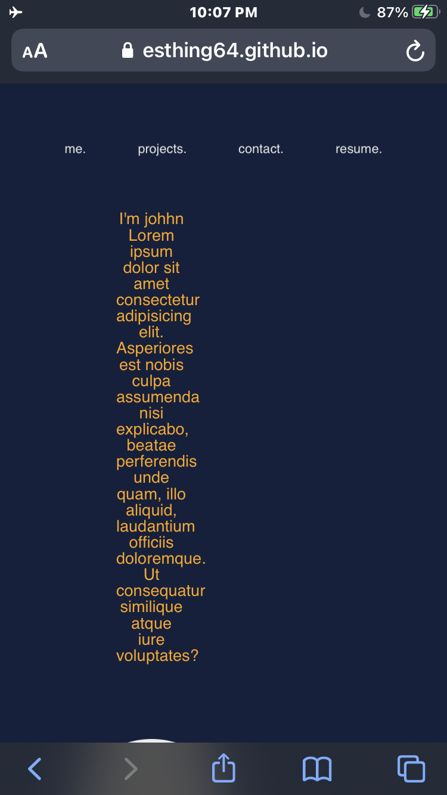
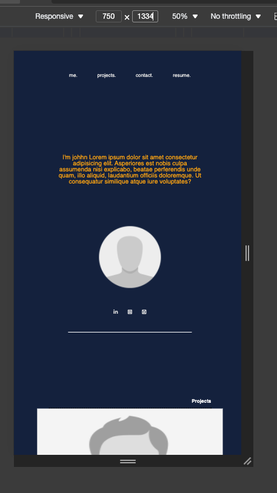

# What is this??? - Project description

This is a starting for my portfolio as a web developer. The photo provided are just place holders and will be updated as I create more projects. The links to social media are also yet to be set to my social media. 

The Contact me section is also purely cosmetic at this point and will be made functional at a later time.


## Media Query
This website has been designed with three desktop screens in mind 3440x1440, 1920 x 1080, and 1334 x 768.

Ipad @ 1024 x 1366

Phones @ 750 x 1334

# Knows Issues 

the paragraph element does load correctly. According to https://www.paintcodeapp.com/news/ultimate-guide-to-iphone-resolutions the iphone 6,7, and 8 render at 750 x 1334.

While in the browser the paragraph has correct margins. When on the iphone 8 it doesn't. See images below.




More screen sized will become compatible with time.


GIVEN I need to sample a potential employee's previous work
WHEN I load their portfolio
THEN I am presented with the developer's name, a recent photo or avatar, and links to sections about them, their work, and how to contact them
WHEN I click one of the links in the navigation
THEN the UI scrolls to the corresponding section
WHEN I click on the link to the section about their work
THEN the UI scrolls to a section with titled images of the developer's applications
WHEN I am presented with the developer's first application
THEN that application's image should be larger in size than the others
WHEN I click on the images of the applications
THEN I am taken to that deployed application
WHEN I resize the page or view the site on various screens and devices
THEN I am presented with a responsive layout that adapts to my viewport
```

